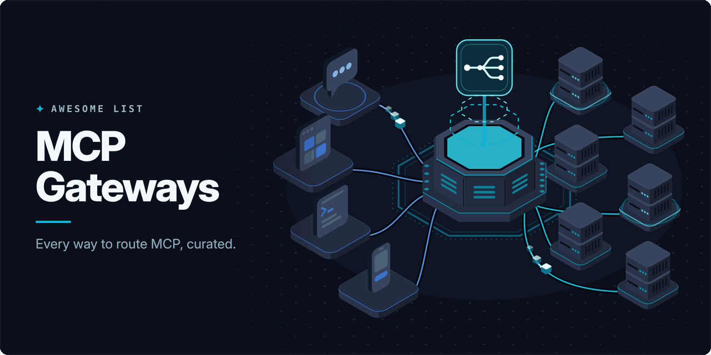

<!-- awesome:hero --><!-- /awesome:hero -->

<!-- awesome:title --><h1 align="center">Awesome MCP Gateways</h1><!-- /awesome:title -->

<!-- awesome:tagline -->Gateways, routers, proxies, aggregators, security layers and registries that sit between MCP clients and MCP servers.<!-- /awesome:tagline -->

<!-- awesome:badges -->

  
  
  

<!-- /awesome:badges -->

A gateway gives many agents one governed way into many MCP servers. Plain MCP servers are out of scope here; the lists under [Related lists](#related-lists) cover them.

## Contents

- [Gateways and control planes](#gateways-and-control-planes)
  - [Open-source gateways](#open-source-gateways)
  - [AI gateways with MCP support](#ai-gateways-with-mcp-support)
  - [Managed gateways](#managed-gateways)
- [Aggregators and local proxies](#aggregators-and-local-proxies)
- [Transport bridges](#transport-bridges)
- [API-to-MCP gateways](#api-to-mcp-gateways)
- [Security and governance](#security-and-governance)
  - [Auth and identity](#auth-and-identity)
  - [Policy and guardrails](#policy-and-guardrails)
  - [Audit and observability](#audit-and-observability)
- [Server managers and runtimes](#server-managers-and-runtimes)
- [Hosted tool platforms](#hosted-tool-platforms)
- [Registries and catalogs](#registries-and-catalogs)
- [Related lists](#related-lists)

## Gateways and control planes

### Open-source gateways

- [agentgateway](https://github.com/agentgateway/agentgateway) - Rust data plane that routes MCP and A2A traffic with auth, policy and telemetry.
- [ContextForge](https://github.com/IBM/mcp-context-forge) - IBM gateway and registry that federates MCP, A2A and REST services into virtual servers.
- [deco Studio](https://github.com/decocms/studio) - Internal AI platform with one MCP endpoint, SSO, RBAC and audit logs for teams.
- [Docker MCP Gateway](https://github.com/docker/mcp-gateway) - Docker CLI plugin that runs MCP servers in containers behind one gateway.
- [Gate22](https://github.com/aipotheosis-labs/gate22) - Self-hosted control plane that sets which tools each team's agents may call.
- [GitHub Agentic Workflows MCP Gateway](https://github.com/github/gh-aw-mcpg) - Gateway that gives sandboxed gh-aw agent runs access to MCP servers.
- [Kuadrant MCP Gateway](https://github.com/Kuadrant/mcp-gateway) - Envoy-based gateway that applies Istio and Kubernetes policy to MCP traffic.
- [MCP Gateway & Registry](https://github.com/agentic-community/mcp-gateway-registry) - Gateway and registry pair with Keycloak or Entra sign-in and tool discovery.
- [MCPHub](https://github.com/samanhappy/mcphub) - Self-hosted hub that groups MCP servers into routed endpoints with a dashboard.
- [MCPX](https://github.com/TheLunarCompany/lunar) - Gateway from lunar.dev that centralizes tool access, permissions and usage data.
- [Microsoft MCP Gateway](https://github.com/microsoft/mcp-gateway) - Kubernetes reverse proxy that routes sessions to MCP servers and runs their lifecycle.
- [Nexus](https://github.com/Nexus-Router/nexus) - Router that joins MCP servers and LLM providers behind one endpoint with tool search.
- [Obot](https://github.com/obot-platform/obot) - Self-hosted platform with an MCP gateway, server catalog and access control.
- [ThinkWatch](https://github.com/ThinkWatchProject/ThinkWatch) - Self-hosted gateway for LLM APIs and MCP tools with SSO, RBAC and PII redaction.
- [Wanaku](https://github.com/wanaku-ai/wanaku) - Proxy between agents and enterprise systems that governs MCP, A2A and model calls.
- [Wirken](https://github.com/gebruder/wirken) - Agent gateway with per-channel isolation, a credential vault and tamper-evident logs.

### AI gateways with MCP support

- [Agent Router](https://github.com/theagentrouter/agent-router) - Envoy-based gateway, formerly Envoy AI Gateway, for model and MCP traffic.
- [AISIX](https://github.com/api7/aisix) - Rust AI gateway from API7 that proxies LLM, MCP and A2A traffic with access rules.
- [Bifrost](https://github.com/maximhq/bifrost) - Go AI gateway with provider failover and load balancing that also fronts MCP tools.
- [Higress](https://github.com/higress-group/higress) - AI-native API gateway, started at Alibaba, that can host and proxy MCP servers.
- [Kong AI Gateway](https://developer.konghq.com/mcp/) - Kong plugins that proxy, secure and observe MCP traffic next to regular APIs.
- [LiteLLM](https://github.com/BerriAI/litellm) - LLM proxy that also serves a shared MCP gateway with per-key tool access.

### Managed gateways

- [Amazon Bedrock AgentCore Gateway](https://docs.aws.amazon.com/bedrock-agentcore/latest/devguide/gateway.html) - AWS service that turns APIs and Lambda functions into MCP tools behind one endpoint.
- [Arcade](https://www.arcade.dev) - Runtime that executes agent tool calls with per-user auth and permission checks.
- [Azure API Management](https://learn.microsoft.com/en-us/azure/api-management/mcp-server-overview) - Azure gateway that exposes REST APIs as MCP servers and fronts existing ones.
- [Cloudflare MCP server portals](https://developers.cloudflare.com/cloudflare-one/access-controls/ai-controls/mcp-portals/) - Cloudflare Access feature that puts many MCP servers behind one signed-in portal.
- [E2B](https://e2b.dev/docs/mcp) - Sandbox cloud with a built-in MCP gateway to a catalog of prebuilt tools.
- [fastn](https://fastn.ai) - Embedded integration layer for SaaS products with an MCP gateway to connected apps.
- [Gatana](https://www.gatana.ai) - MCP gateway that centralizes servers, credentials, federated identity and access rules.
- [Golf](https://www.golf.dev) - Security service that finds and governs agent connections to company systems over MCP.
- [MCP Manager](https://www.mcpmanager.ai) - Enterprise gateway with access controls, audit trails and guardrails for MCP.
- [mcpgate](https://mcpgate.de) - Self-hosted gateway with PII pseudonymization, policy hooks and built-in integrations.
- [Metorial](https://metorial.com) - Connects agents to many integrations over MCP, with tracing and access control.
- [MintMCP](https://mintmcp.com) - Hosted gateway with one-click server deploys, SSO, role rules and monitoring.
- [Peta](https://peta.io) - Self-hosted vault and gateway that asks a human before risky tool calls.
- [Runlayer](https://www.runlayer.com) - Platform that ties identity, approved MCP servers and AI clients to one set of controls.
- [Scalekit AgentKit](https://www.scalekit.com/agentkit) - Tool-calling layer that lets agents act for users with delegated auth and token storage.
- [Speakeasy AI Control Plane](https://www.speakeasy.com/product/ai-control-plane) - Control plane that governs access and audits sessions across MCP servers and skills.
- [Traefik MCP Gateway](https://traefik.io/solutions/mcp-gateway) - Traefik Hub feature with task-based access control and session-aware MCP routing.
- [TrueFoundry MCP Gateway](https://www.truefoundry.com/mcp-gateway) - Enterprise gateway with RBAC, OAuth, tool discovery and observability across servers.
- [TurboMCP](https://turbomcp.ai) - Self-hosted gateway and management platform for MCP servers.
- [Willow](https://withwillow.ai) - Finds the agents and MCP servers in an org and routes them through a gateway.
- [Zuplo MCP Gateway](https://zuplo.com/mcp-gateway) - API gateway feature that federates remote MCP servers behind one compliant endpoint.

## Aggregators and local proxies

- [1 MCP Server](https://github.com/particlefuture/1mcpserver) - Remote MCP server that searches for and sets up other MCP servers for you.
- [AIRIS MCP Gateway](https://github.com/agiletec-inc/airis-mcp-gateway) - Local MCP endpoint that starts tool servers only when a task needs them.
- [claw-tsaver](https://github.com/Yang1Bai/claw-tsaver) - Proxy that swaps oversized tool results for a short preview and a fetch handle.
- [Context Firewall](https://github.com/Alepha188838884/context-firewall) - Proxy that folds many servers into a few meta-tools and trims large tool outputs.
- [FLUJO](https://github.com/mario-andreschak/FLUJO) - Local MCP client and workflow builder that re-serves its configured servers over HTTP.
- [Forage](https://github.com/isaac-levine/forage) - Meta-server that searches registries and installs new MCP servers mid-session.
- [Gridctl](https://github.com/gridctl/gridctl) - Gateway that serves a set of MCP servers together with a shared skill library.
- [Lazy MCP](https://github.com/voicetreelab/lazy-mcp) - Proxy that keeps tools hidden until the agent turns them on, saving context.
- [Magg](https://github.com/sitbon/magg) - Meta-server that lets the model find, install and run other MCP servers itself.
- [MCP Aggregator](https://github.com/nazar256/combine-mcp) - Go stdio aggregator that merges several servers into one and filters their tools.
- [MCP Hub](https://github.com/ni-c/mcp-hub) - Container that serves many stdio servers over HTTPS with path routing and OAuth 2.1.
- [MCP Orchestrator](https://github.com/rupinder2/mcp-orchestrator) - Hub that merges tools from many servers with BM25 search and deferred loading.
- [mcp-gateway](https://github.com/MikkoParkkola/mcp-gateway) - Single-port gateway that replaces per-tool registrations with a few meta-tools.
- [mcpd-proxy](https://github.com/mozilla-ai/mcpd-proxy) - Proxy that hands the servers run by mcpd to an IDE as one MCP server.
- [MCPJungle](https://github.com/mcpjungle/MCPJungle) - Self-hosted registry and proxy that serves every registered server through one endpoint.
- [mcpproxy-go](https://github.com/smart-mcp-proxy/mcpproxy-go) - Local proxy that routes many servers through one endpoint with BM25 tool filtering.
- [mcptoon](https://github.com/activeing123/mcptoon) - CLI that serves all configured servers from one process with compact tool discovery.
- [MetaMCP](https://github.com/metatool-ai/metamcp) - Docker-based aggregator that groups MCP servers into namespaces with middleware.
- [NCP](https://github.com/portel-dev/ncp) - Orchestrator that searches tools across your MCP servers and loads them on demand.
- [Omega MCP Router](https://github.com/Omega-JS-Stack/omega/tree/main/packages/mcp-router) - Stdio router for many MCP servers that caches tool schemas and starts each on first use.
- [Plugged.in MCP Proxy](https://github.com/VeriTeknik/pluggedin-mcp-proxy) - Proxy that combines servers into one, with a web app for tools, prompts and testing.
- [PMCP](https://github.com/Consiliency/pmcp) - Claude Code meta-server that reveals tools step by step and starts servers on demand.
- [TBXark/mcp-proxy](https://github.com/TBXark/mcp-proxy) - Go server that merges many MCP servers behind one HTTP endpoint.
- [Toolfunnel](https://github.com/Rendeverance/toolfunnel) - Zero-dependency gateway that curates tools from several servers and hosts your own.
- [Toolport](https://github.com/btsouth/toolport) - Local gateway that shares one set of servers across AI clients, secrets in the keychain.

## Transport bridges

- [MCP Proxy for AWS](https://github.com/aws/mcp-proxy-for-aws) - Local proxy that signs requests with SigV4 for remote MCP servers on AWS.
- [mcp_proxy_rust](https://github.com/tidewave-ai/mcp_proxy_rust) - Rust binary that connects stdio clients to HTTP and SSE MCP servers.
- [MCP-Bridge](https://github.com/SecretiveShell/MCP-Bridge) - Middleware that gives OpenAI-compatible clients access to MCP tools.
- [MCP-connect](https://github.com/EvalsOne/MCP-connect) - HTTP bridge that lets cloud AI services call local stdio MCP servers.
- [mcp-remote](https://github.com/punkpeye/mcp-remote) - Lets stdio-only clients reach remote MCP servers, OAuth included.
- [mcpo](https://github.com/open-webui/mcpo) - Serves MCP servers as OpenAPI HTTP endpoints for tools that speak REST.
- [punkpeye/mcp-proxy](https://github.com/punkpeye/mcp-proxy) - TypeScript wrapper that serves a stdio server over Streamable HTTP and SSE.
- [sparfenyuk/mcp-proxy](https://github.com/sparfenyuk/mcp-proxy) - Python bridge between stdio and Streamable HTTP or SSE, in either direction.
- [Supergateway](https://github.com/supercorp-ai/supergateway) - Runs stdio MCP servers over SSE, WebSockets or Streamable HTTP, and back again.

## API-to-MCP gateways

- [AnythingMCP](https://github.com/HelpCode-ai/anythingmcp) - Self-hosted gateway that turns REST, SOAP, GraphQL and SQL sources into MCP tools.
- [APIFold](https://github.com/Work90210/APIFold) - Turns REST APIs into hosted MCP servers from their specs, with no code.
- [MCP Access Point](https://github.com/sxhxliang/mcp-access-point) - Gateway that exposes existing HTTP services as MCP servers without code changes.
- [OpenAPI MCP Gateway](https://github.com/mroops0111/openapi-mcp-gateway) - Mounts several OpenAPI specs as MCP servers in one process with per-user OAuth2.
- [Unla](https://github.com/AmoyLab/Unla) - Go gateway that turns existing APIs and MCP servers into MCP endpoints through config.

## Security and governance

### Auth and identity

- [Aegis](https://github.com/getaegis/aegis) - Local proxy that injects API keys at the network edge so agents never see them.
- [AuthMCP Gateway](https://github.com/loglux/authmcp-gateway) - Auth proxy with OAuth2 DCR, JWT, RBAC, rate limits and a monitoring dashboard.
- [Governed MCP Gateway](https://github.com/Cubiczan/governed-mcp-gateway) - HTTP gateway that tags each tool call with a principal and rotates vaulted credentials.
- [MCPAuth](https://github.com/oidebrett/mcpauth) - Gateway that adds external OAuth sign-in and authorization in front of MCP servers.
- [Octelium](https://github.com/octelium/octelium) - Zero trust access platform that can also act as a secure gateway for MCP servers.
- [OpenZiti MCP Gateway](https://github.com/openziti/mcp-gateway) - Zero trust gateway that reaches MCP servers over an overlay with no open ports.
- [Pomerium](https://github.com/pomerium/pomerium) - Identity-aware access proxy that can guard MCP servers with per-tool policies.

### Policy and guardrails

- [AgentWard](https://github.com/agentward-ai/agentward) - Proxy that enforces least-privilege YAML policies and flags PII in tool calls.
- [Aggrete](https://github.com/aggrete/aggrete) - Proxy that blocks tool-call combinations that break a written policy across connectors.
- [Assay](https://github.com/Rul1an/assay) - Fail-closed policy proxy that records verifiable evidence of each tool decision.
- [ctrlrun](https://github.com/CTRLRun/ctrlrun) - Python layer that checks agent actions against rules and holds risky ones for approval.
- [Enkrypt Secure MCP Gateway](https://github.com/enkryptai/secure-mcp-gateway) - Gateway that applies guardrails to the inputs and outputs of each upstream server.
- [Fida](https://github.com/ajipurn/fida) - Local gateway that redacts secrets from file reads and command output.
- [Gatekit](https://github.com/gatekit-ai/gatekit) - Plugin-based gateway for tool filtering, content checks, audit logs and token tracking.
- [Lasso MCP Gateway](https://github.com/lasso-security/mcp-gateway) - Plugin-based gateway that scans and masks traffic between agents and MCP servers.
- [Mastyf](https://github.com/mastyf-ai/mastyf.ai) - Security proxy that blocks injection, SSRF and credential theft in agent tool traffic.
- [MCP Bastion](https://github.com/Gowthaman90/mcp-bastion) - Proxy that pins tool definitions and blocks poisoning, exfiltration and injection.
- [MCP Defender](https://github.com/MCP-Defender/MCP-Defender) - Desktop app that scans and blocks malicious MCP traffic in AI apps.
- [mcp-context-protector](https://github.com/trailofbits/mcp-context-protector) - Trail of Bits wrapper that pins server config and screens output for prompt injection.
- [MCP-Dandan](https://github.com/82ch/MCP-Dandan) - Desktop tool that proxies MCP calls and flags malicious tool behavior.
- [mcp-guardian](https://github.com/rudraneel93/mcp-guardian) - Governance proxy with YAML policies, token budgets, health checks and RBAC.
- [mcpwall](https://github.com/behrensd/mcpwall) - Deterministic proxy that applies firewall-style rules to MCP tool calls.
- [pod](https://github.com/suhui-organization/pod) - Compiles a least-privilege policy from recorded tool calls and enforces it at a gateway.
- [ReasonGate](https://github.com/cgrtml/reasongate) - Gate that blocks tool calls steered by untrusted tool output, giving a reason for each.
- [SafeNode MCP Gateway](https://github.com/sp3ak/safenode-mcp-gateway) - Fail-closed proxy that denies, warns on or holds each tool call for approval.
- [ScopeBlind Gateway](https://github.com/ScopeBlind/scopeblind-gateway) - Gateway with Cedar policies and signed receipts for each tool call.
- [Shield](https://github.com/AperionAI/shield) - Local proxy that blocks destructive commands and pins tool catalogs for coding agents.
- [SidClaw](https://github.com/sidclawhq/platform) - Governance proxy with policy checks, human approval and hash-chained traces.

### Audit and observability

- [Heimdall](https://github.com/enmanuelmag/heimdall-mcp) - Proxy that traces JSON-RPC traffic into SQL databases and OpenTelemetry.
- [MCP Audit](https://github.com/P4ST4S/mcp-audit) - Go proxy that signs, rate-limits, redacts and logs every tool call.
- [MCP Audit Gateway](https://github.com/elang2/mcp-audit-gateway) - Proxy that keeps a signed, hash-chained audit trail of agent tool calls.
- [mcp-log-proxy](https://github.com/emicklei/mcp-log-proxy) - Proxy with a web page that shows each message between client and server.
- [MCPSpend](https://github.com/andreisirbu91-lab/MCPSpend) - Proxy that attributes tool-call cost per tool, project and customer.

## Server managers and runtimes

- [mcpd](https://github.com/mozilla-ai/mcpd) - Declarative runner for MCP servers, from local development to containers.
- [MCPM](https://github.com/pathintegral-institute/mcpm.sh) - CLI package manager for MCP servers with profiles and a built-in router.
- [ToolHive](https://github.com/stacklok/toolhive) - Runs MCP servers in isolated containers with managed secrets and a proxy per server.

## Hosted tool platforms

- [Aident Loadout](https://aident.ai) - Hosted MCP that connects agents to 1,000+ apps through one reusable setup.
- [Alpic](https://alpic.ai) - Cloud for deploying, monitoring and distributing MCP servers and ChatGPT apps.
- [Composio](https://composio.dev) - Tool platform with delegated auth across many apps, reachable over MCP.
- [Klavis](https://github.com/Klavis-AI/klavis) - Open-source MCP integration platform with hosted servers and built-in auth.
- [Manufact](https://manufact.com) - MCP cloud from the mcp-use team for deploying, testing and monitoring servers.
- [One](https://github.com/withoneai/mcp) - One MCP server that searches and calls authenticated APIs across many apps.
- [Pipedream MCP](https://mcp.pipedream.com) - Hosted MCP servers for thousands of APIs with managed user auth.
- [ToolRouter](https://toolrouter.com) - One MCP connection to a pool of hosted tools billed per call.
- [Zapier MCP](https://zapier.com/mcp) - Exposes actions across thousands of Zapier apps to any MCP client.

## Registries and catalogs

- [Docker MCP Catalog](https://hub.docker.com/mcp) - Docker Hub catalog of containerized MCP servers.
- [Docker MCP Registry](https://github.com/docker/mcp-registry) - Source repo where servers are submitted to the Docker MCP Catalog.
- [GitHub MCP Registry](https://github.com/mcp) - GitHub's directory of MCP servers with one-click installs into supported clients.
- [Glama MCP directory](https://glama.ai/mcp/servers) - Searchable directory of MCP servers with quality scores for each one.
- [MCP Registry](https://github.com/modelcontextprotocol/registry) - Official registry service and API where MCP server metadata is published.
- [MCP.so](https://mcp.so) - Community marketplace that lists MCP servers and clients.
- [mcpqueen](https://github.com/mcpqueen/mcpqueen) - Probes servers from the official registry live and grades them with recorded evidence.
- [mcpservers.org](https://mcpservers.org) - Web directory of MCP servers that takes submissions for the wong2 list.
- [PulseMCP](https://www.pulsemcp.com/servers) - Directory of MCP servers and clients with a weekly newsletter.
- [RAGMap](https://github.com/khalidsaidi/ragmap) - Subregistry that finds and ranks retrieval-capable MCP servers.
- [Smithery](https://smithery.ai) - Registry and hosting service that connects agents to MCP servers with managed auth.
- [ToolSDK MCP Registry](https://github.com/toolsdk-ai/toolsdk-mcp-registry) - Structured JSON registry of MCP servers that also ships a self-hosted gateway.

## Related lists

- [Awesome MCP Clients](https://github.com/punkpeye/awesome-mcp-clients) - List of applications that act as MCP clients.
- [Awesome MCP Gateways (e2b-dev)](https://github.com/e2b-dev/awesome-mcp-gateways) - Short list of open-source and commercial MCP gateways.
- [Awesome MCP Security](https://github.com/Puliczek/awesome-mcp-security) - Papers, articles and tools on securing MCP clients and servers.
- [Awesome MCP Servers (punkpeye)](https://github.com/punkpeye/awesome-mcp-servers) - Large categorized list of MCP servers, synced with the Glama directory.
- [Awesome MCP Servers (wong2)](https://github.com/wong2/awesome-mcp-servers) - List of reference, official and community MCP servers.

## Contributing

Read the [contribution guidelines](contributing.md) before you open a pull request.

<!-- awesome:maintainer -->
Maintained by [Ian Wiedenman](https://github.com/ianwieds).
<!-- /awesome:maintainer -->
